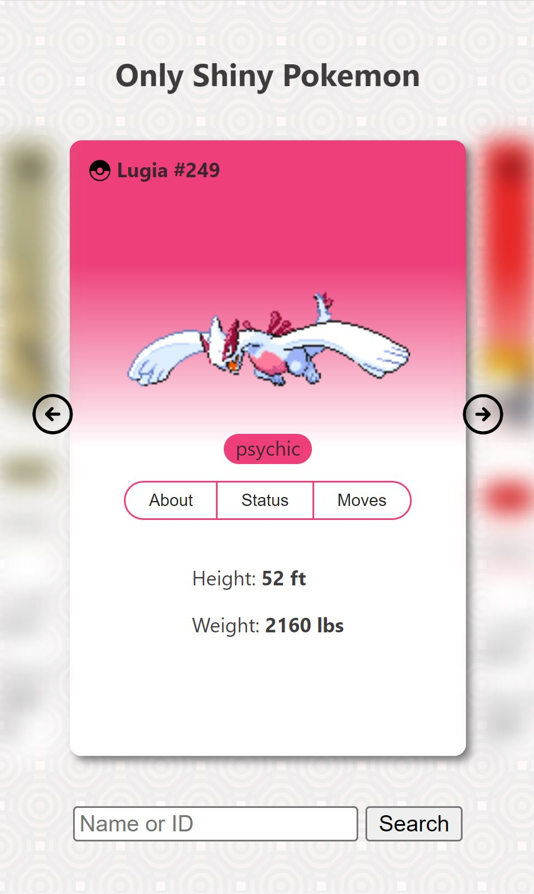
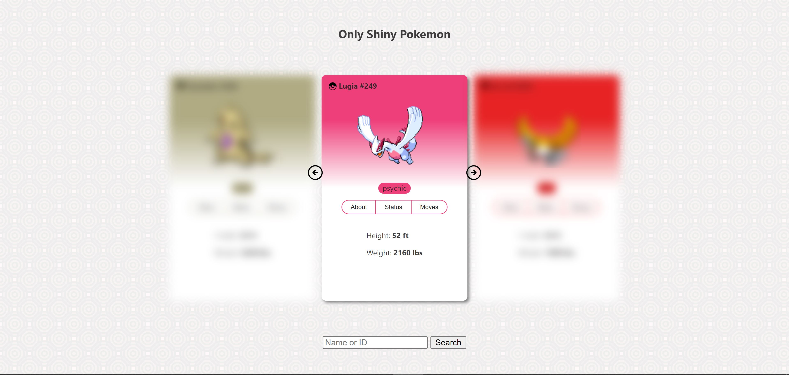

# PokeAPI Project 🌟

## Description 📖

This project utilizes version 2 of the PokeAPI and is designed to offer an interactive experience for exploring detailed information about Pokémon. It features an interactive card carousel with charming Pokémon animations and a search field for searching by name or ID.

## Screenshots 📸

## Key Features 🚀

- Utilizes version V2 of the PokeAPI.
- Interactive Pokémon card carousel with delightful animations.
- Search by Pokémon name or ID for a personalized experience.
- Fully responsive design that adapts seamlessly to any device.

## Installation and Usage 🛠️

To download and deploy the project, follow these simple steps:

1. Clone this repository to your local machine:

2. Run the following command in your console:

    npm run dev

3. Explore and navigate the Pokémon world.

## Dependencies 📦

This project has no external dependencies, making it even more accessible and user-friendly.

## Contribution 🤝

Currently, this project is offered solely for viewing purposes, and external contributions are not accepted at this time.

## License 📜

This project is under a Personal License.

## Credits 💡

- Official PokeAPI: [API Link](https://pokeapi.co/)

